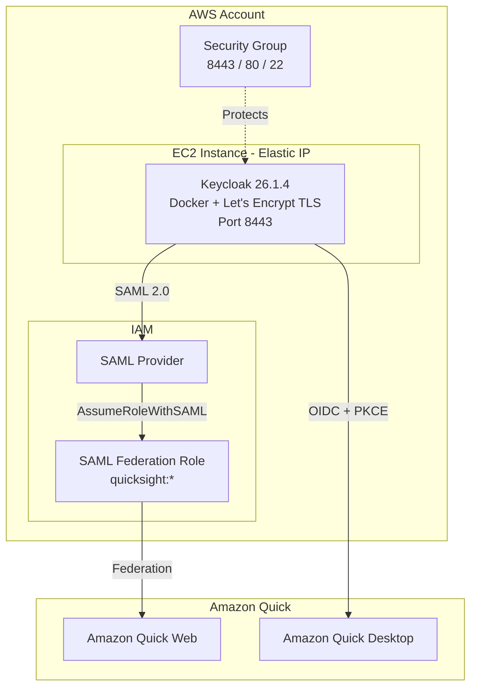

# Keycloak IdP for Amazon Quick (Web & Desktop)

[中文版](README.zh.md) | English

One-click CloudFormation deployment of a Keycloak 26.1.4 Identity Provider pre-configured for both **Amazon Quick Web** (SAML 2.0) and **Amazon Quick Desktop** (OIDC + PKCE).

## Architecture



## What Gets Deployed

| Resource | Description |
|----------|-------------|
| EC2 Instance | t3.small with Keycloak 26.1.4 (Docker), auto-configured |
| Elastic IP | Fixed public IP (survives instance stop/start) |
| Security Group | Ports 8443 (Keycloak HTTPS), 80 (cert renewal), 22 (SSH, optional) |
| IAM SAML Provider | Federation with Keycloak for Amazon Quick Web |
| IAM Role | SAML federation role for Amazon Quick access |
| TLS Certificate | Auto-provisioned via Let's Encrypt with auto-renewal cron job |

## Prerequisites

- An AWS account with permissions to create EC2, IAM, and CloudFormation resources
- An Amazon Quick application (for connecting SSO after deployment)

## Quick Deploy

### Option 1: AWS Console

[](https://console.aws.amazon.com/cloudformation/home#/stacks/new?templateURL=https://raw.githubusercontent.com/xina0311/amazon-quick-desktop-federation-with-keycloak/main/keycloak-quick-desktop-cfn.yaml)

### Option 2: AWS CLI

```bash
aws cloudformation create-stack \
  --stack-name keycloak-quick-idp \
  --template-body file://keycloak-quick-desktop-cfn.yaml \
  --parameters ParameterKey=AdminPwd,ParameterValue='YOUR_STRONG_PASSWORD_HERE' \
  --capabilities CAPABILITY_NAMED_IAM \
  --region us-east-1
```

> **Important**: Replace `YOUR_STRONG_PASSWORD_HERE` with a strong password (8-32 chars, alphanumeric + `_` `-`). This password is used for both the Keycloak admin account and the test user.

## Parameters

| Parameter | Required | Description |
|-----------|----------|-------------|
| `AdminPwd` | **Yes** | Password for Keycloak admin and test user. Must be 8-32 chars, alphanumeric + `_` and `-`. |
| `InstanceType` | No | EC2 instance type (default: `t3.small`) |
| `QuickUserEmail` | No | If provided, creates an additional Keycloak user with this email |
| `KeyPairName` | No | EC2 Key Pair for SSH access (leave empty to disable SSH login) |
| `QuickSightRoleName` | No | IAM role name for SAML federation (default: `QuickSight-Keycloak-SSO-Role`) |
| `SAMLProviderName` | No | IAM SAML provider name (default: `Keycloak`) |

## Security Notes

- **You must provide a strong password** — the template has no default password, deployment will fail without one.
- The Keycloak admin console is accessible at `https://<EIP>.nip.io:8443/admin/` — restrict access via Security Group if needed.
- Port 22 (SSH) is open by default. Remove it from the Security Group if not needed.
- TLS is enforced via Let's Encrypt certificate (auto-provisioned, auto-renewed via daily cron job).
- The IAM role grants `quicksight:*` permissions — scope down for production use.

## Deployment Timeline

The stack takes approximately **15-20 minutes** to reach `CREATE_COMPLETE`. The UserData script:

1. Installs Docker, certbot, and dependencies
2. Obtains a Let's Encrypt TLS certificate
3. Starts Keycloak container
4. Configures realm, OIDC client, SAML client, and test user
5. Updates IAM SAML Provider with real Keycloak metadata
6. Sets up certificate auto-renewal (daily cron)
7. Signals CloudFormation success

## Stack Outputs

After successful deployment, the stack provides these outputs:

| Output | Description |
|--------|-------------|
| `KeycloakURL` | Keycloak base URL |
| `AdminConsoleURL` | Keycloak admin console |
| `IssuerURL` | OIDC Issuer URL (for Amazon Quick Desktop) |
| `AuthEndpoint` | OIDC Authorization endpoint |
| `TokenEndpoint` | OIDC Token endpoint |
| `JWKSURI` | OIDC JWKS endpoint |
| `ClientID` | OIDC Client ID (`amazon-quick-desktop`) |
| `SAMLProviderArn` | IAM SAML Provider ARN (for Amazon Quick Web) |
| `QuickSightRoleArn` | IAM Role ARN for SAML federation |
| `SAMLMetadataUrl` | SAML metadata URL |
| `IdPInitiatedSSOUrl` | IdP-initiated SSO URL |

## After Deployment

See [USAGE-GUIDE.md](USAGE-GUIDE.md) for step-by-step instructions on:
1. Configuring Amazon Quick Web with SAML SSO
2. Configuring Amazon Quick Desktop with OIDC
3. Testing login with the pre-created test user

## Test User

The template creates a test user in Keycloak:
- **Username**: `ws-lab-7f3k`
- **Email**: `ws-lab-7f3k@quick.aws`
- **Password**: Same as `AdminPwd` parameter

## Cost Estimate

- EC2 t3.small: ~$15/month (us-east-1)
- Elastic IP (attached): Free
- Data transfer: Minimal

## Cleanup

```bash
aws cloudformation delete-stack --stack-name keycloak-quick-idp --region us-east-1
```

This removes all resources including the EC2 instance, EIP, IAM roles, and SAML provider.

## License

MIT
