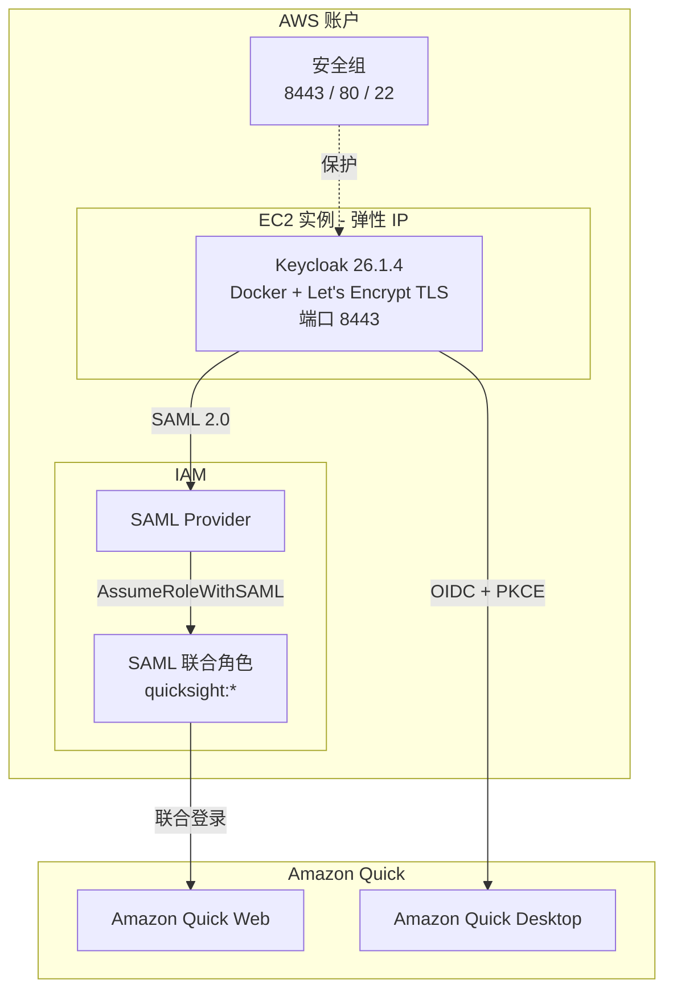

# Keycloak IdP for Amazon Quick（Web & Desktop）

中文 | [English](README.md)

一键 CloudFormation 部署 Keycloak 26.1.4 身份提供商（IdP），预配置支持 **Amazon Quick Web**（SAML 2.0）和 **Amazon Quick Desktop**（OIDC + PKCE）。

## 架构



## 部署的资源

| 资源 | 说明 |
|------|------|
| EC2 实例 | t3.small，运行 Keycloak 26.1.4（Docker），全自动配置 |
| 弹性 IP | 固定公网 IP（实例停止/启动后不变） |
| 安全组 | 端口 8443（Keycloak HTTPS）、80（证书续期）、22（SSH，可选） |
| IAM SAML Provider | 与 Keycloak 联合，用于 Amazon Quick Web |
| IAM Role | SAML 联合角色，用于 Amazon Quick 访问 |
| TLS 证书 | Let's Encrypt 自动申请 + 每月自动续期 |

## 前提条件

- 一个 AWS 账户，有权限创建 EC2、IAM 和 CloudFormation 资源
- 一个 Amazon Quick 应用（部署后用于对接 SSO）

## 快速部署

### 方式一：AWS 控制台

[](https://console.aws.amazon.com/cloudformation/home#/stacks/new?templateURL=https://raw.githubusercontent.com/xina0311/amazon-quick-desktop-federation-with-keycloak/main/keycloak-quick-desktop-cfn.yaml)

### 方式二：AWS CLI

```bash
aws cloudformation create-stack \
  --stack-name keycloak-quick-idp \
  --template-body file://keycloak-quick-desktop-cfn.yaml \
  --parameters ParameterKey=AdminPwd,ParameterValue='你的强密码' \
  --capabilities CAPABILITY_NAMED_IAM \
  --region us-east-1
```

> **重要**：请将 `你的强密码` 替换为一个强密码（8-32 位，支持字母数字 + `_` `-`）。此密码同时用于 Keycloak 管理员账户和测试用户。

## 参数

| 参数 | 必填 | 说明 |
|------|------|------|
| `AdminPwd` | **是** | Keycloak 管理员及测试用户密码。8-32 位，字母数字 + `_` `-`。 |
| `InstanceType` | 否 | EC2 实例类型（默认：`t3.small`） |
| `QuickUserEmail` | 否 | 如提供，会额外创建一个使用该邮箱的 Keycloak 用户 |
| `KeyPairName` | 否 | EC2 Key Pair，用于 SSH（留空则禁用 SSH 登录） |
| `QuickSightRoleName` | 否 | SAML 联合 IAM 角色名（默认：`QuickSight-Keycloak-SSO-Role`） |
| `SAMLProviderName` | 否 | IAM SAML Provider 名称（默认：`Keycloak`） |

## 安全说明

- **必须提供强密码** — 模板没有默认密码，不提供会部署失败。
- Keycloak 管理控制台地址：`https://<EIP>.nip.io:8443/admin/` — 如需限制访问请修改安全组。
- 端口 22（SSH）默认开放，不需要可从安全组移除。
- TLS 通过 Let's Encrypt 强制加密，每月自动续期。
- IAM 角色授予 `quicksight:*` 权限 — 生产环境请收窄权限范围。

## 部署时间

Stack 大约需要 **15-20 分钟** 达到 `CREATE_COMPLETE`。UserData 脚本执行：

1. 安装 Docker、certbot 等依赖
2. 申请 Let's Encrypt TLS 证书
3. 启动 Keycloak 容器
4. 配置 Realm、OIDC Client、SAML Client 和测试用户
5. 用真实 Keycloak metadata 更新 IAM SAML Provider
6. 设置证书自动续期（每日 cron）
7. 向 CloudFormation 发送成功信号

## Stack 输出

部署成功后，Stack 提供以下输出：

| 输出 | 说明 |
|------|------|
| `KeycloakURL` | Keycloak 基础 URL |
| `AdminConsoleURL` | Keycloak 管理控制台 |
| `IssuerURL` | OIDC Issuer URL（用于 Amazon Quick Desktop 配置） |
| `AuthEndpoint` | OIDC 授权端点 |
| `TokenEndpoint` | OIDC Token 端点 |
| `JWKSURI` | OIDC JWKS 端点 |
| `ClientID` | OIDC Client ID（`amazon-quick-desktop`） |
| `SAMLProviderArn` | IAM SAML Provider ARN（用于 Amazon Quick Web 配置） |
| `QuickSightRoleArn` | IAM 联合角色 ARN |
| `SAMLMetadataUrl` | SAML metadata URL |
| `IdPInitiatedSSOUrl` | IdP 发起的 SSO URL |

## 部署后配置

参见 [USAGE-GUIDE.zh.md](USAGE-GUIDE.zh.md) 了解：
1. 如何为 Amazon Quick Web 配置 SAML SSO
2. 如何为 Amazon Quick Desktop 配置 OIDC
3. 如何使用预创建的测试用户登录

## 测试用户

模板在 Keycloak 中预创建了一个测试用户：
- **用户名**：`ws-lab-7f3k`
- **邮箱**：`ws-lab-7f3k@quick.aws`
- **密码**：与 `AdminPwd` 参数相同

## 费用估算

- EC2 t3.small：约 $15/月（us-east-1）
- 弹性 IP（已关联）：免费
- 数据传输：极少

## 清理资源

```bash
aws cloudformation delete-stack --stack-name keycloak-quick-idp --region us-east-1
```

将删除所有资源，包括 EC2 实例、EIP、IAM 角色和 SAML Provider。

## License

MIT
