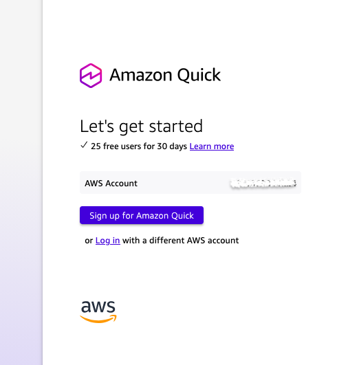
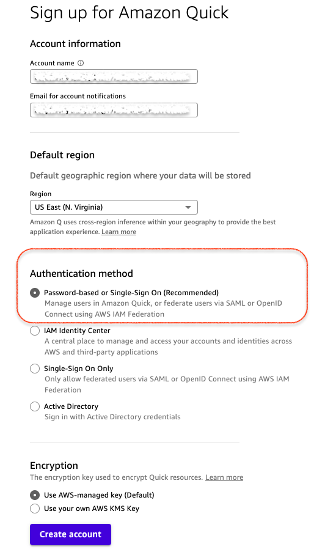
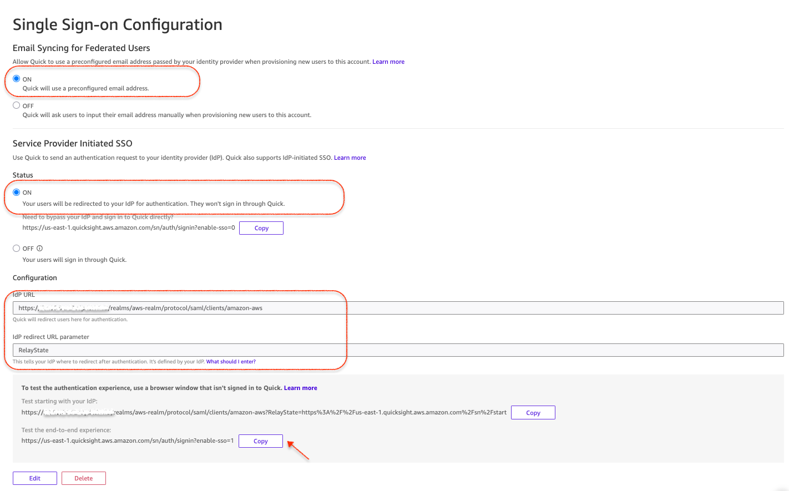
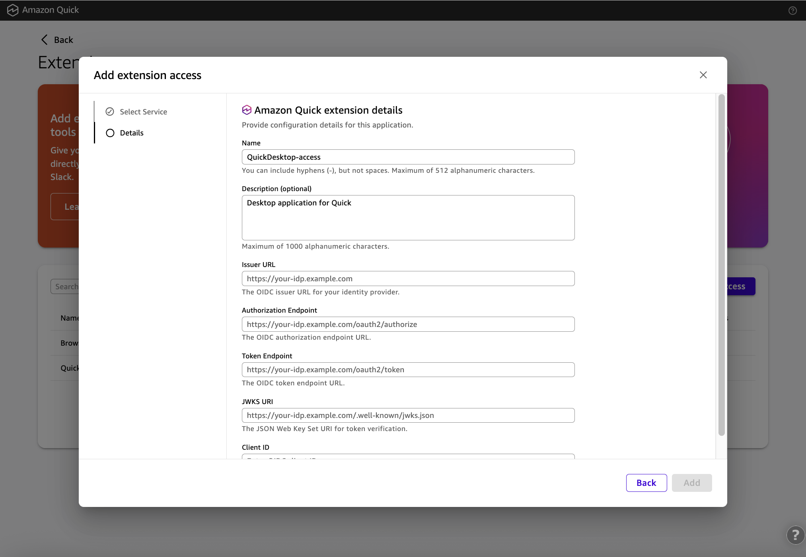
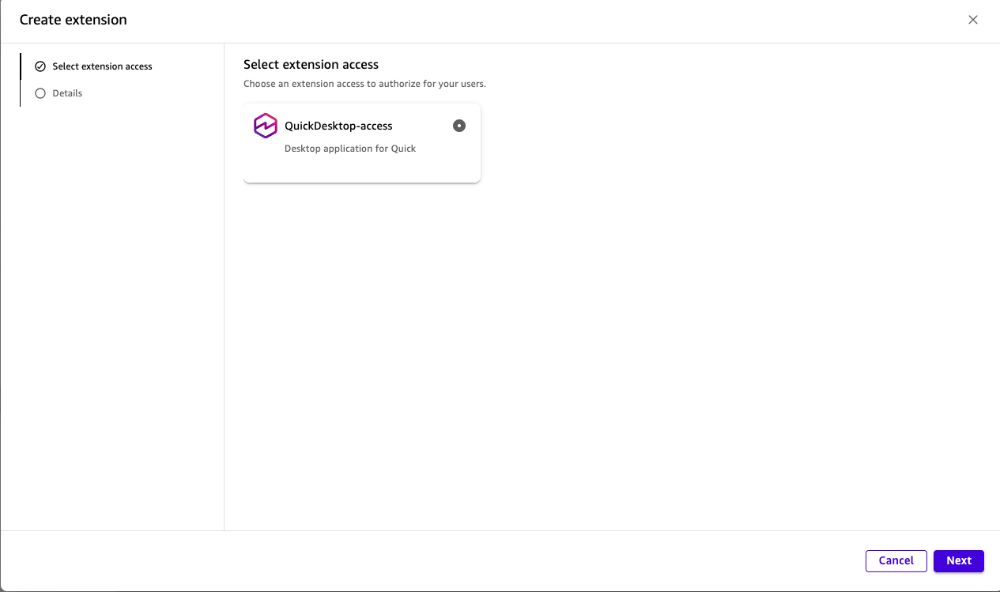

# Usage Guide: Configure Amazon Quick with Keycloak SSO

[中文版](USAGE-GUIDE.zh.md) | English

This guide walks you through connecting your deployed Keycloak IdP to Amazon Quick Web (SAML) and Amazon Quick Desktop (OIDC).

## Prerequisites

- CloudFormation stack is in `CREATE_COMPLETE` status
- You have access to the AWS Console with admin permissions
- Stack outputs ready (run command below to retrieve)

```bash
aws cloudformation describe-stacks \
  --stack-name keycloak-quick-idp \
  --query 'Stacks[0].Outputs' \
  --output table
```

---

## Phase 0: Sign Up for Amazon Quick

If you don't have an Amazon Quick account yet:

1. Go to the Amazon Quick console and click **Sign up for Amazon Quick**

   

2. Fill in account details:
   - **Account name**: Choose a name (e.g., `anycompany-quick`)
   - **Email for account notifications**: Your admin email
   - **Default region**: US East (N. Virginia)
   - **Authentication method**: Select **Password-based or Single-Sign On (Recommended)**
   - **Encryption**: Use AWS-managed key (Default)
   - Click **Create account**

   

> **Important**: You must select "Password-based or Single-Sign On" to enable SAML/OIDC federation with Keycloak.

---

## Phase 1: Configure Quick Web SAML SSO

### Step 1: Open SSO Configuration Page

1. Log in to the Amazon Quick Admin Console
2. Left menu → **Single Sign-on (SSO)**
3. URL format: `https://us-east-1.quicksight.aws.amazon.com/sn/account/<ACCOUNT_NAME>/admin`

### Step 2: Enable Email Syncing for Federated Users

At the top of the SSO page:
- Set **Email Syncing for Federated Users** → **ON**
- This allows Quick to use the preconfigured email address from your IdP

### Step 3: Configure Service Provider Initiated SSO

Fill in the Configuration section:

| Field | Value |
|-------|-------|
| IdP URL | `https://<EIP>.nip.io:8443/realms/aws-realm/protocol/saml/clients/amazon-aws` |
| IdP redirect URL parameter | `RelayState` |

Click **Save** and wait until the fields become disabled (Edit/Delete buttons appear).

> **Warning**: You MUST click Save BEFORE turning on SSO. If you toggle ON first, you'll get an error "Enter a configuration first".

### Step 4: Turn On SSO

1. Under **Status**, click **ON**
2. Confirm dialog "Turn on SSO?" → Click **Turn on SSO**

   

### Step 5: Test Quick Web SSO

Open an incognito browser window and visit:

```
https://us-east-1.quicksight.aws.amazon.com/sn/auth/signin?account=<ACCOUNT_NAME>&enable-sso=1
```

You should be redirected to Keycloak login. Enter:
- Username: `ws-lab-7f3k`
- Password: Your `AdminPwd`

After authentication, you'll be redirected back to Amazon Quick Web.

---

## Phase 2: Configure Quick Desktop OIDC (Extension Access)

### Step 1: Open Extension Access Page

In the Amazon Quick Admin Console:
- Left menu → **Extension access** (under Permissions section)

### Step 2: Add Extension Access

1. Click **Add extension access**
2. Select **Amazon Quick — Desktop application for Quick**
3. Click **Next** to proceed to the Details page

### Step 3: Fill in OIDC Configuration

   

| Field | Value |
|-------|-------|
| Name | `QuickDesktop-access` (pre-filled, keep as-is) |
| Description | `Desktop application for Quick` (pre-filled) |
| Issuer URL | `https://<EIP>.nip.io:8443/realms/aws-realm` |
| Authorization Endpoint | `https://<EIP>.nip.io:8443/realms/aws-realm/protocol/openid-connect/auth` |
| Token Endpoint | `https://<EIP>.nip.io:8443/realms/aws-realm/protocol/openid-connect/token` |
| JWKS URI | `https://<EIP>.nip.io:8443/realms/aws-realm/protocol/openid-connect/certs` |
| Client ID | `amazon-quick-desktop` |

> **Warning**: OIDC configuration fields cannot be edited after creation. You can only delete and recreate. Double-check all values before clicking Add.

### Step 4: Submit

Click **Add**. You should see a green notification: "QuickDesktop-access added successfully".

---

## Phase 3: Create and Activate Desktop Extension

### Step 1: Go to Extensions Page

Switch to the **Amazon Quick Console** (not Admin Console):
- Left menu → **Extensions**

### Step 2: Create Extension

1. Click **Create extension** (top right)
2. Select **QuickDesktop-access** from the list
3. Click **Next**

   

4. Confirm and ensure status shows **Active**

### Step 3: Download Desktop Client

From the QuickDesktop-extension row:
- Click the **...** menu on the right
- Select **Download for Mac** or **Download for Windows**

> **Important**: This step cannot be skipped! Without an active Extension, the Desktop client cannot discover the OIDC configuration.

---

## Phase 4: Test and Verify

### Quick Web SSO Test

1. Open incognito browser
2. Visit: `https://us-east-1.quicksight.aws.amazon.com/sn/auth/signin?account=<ACCOUNT_NAME>&enable-sso=1`
3. Redirects to Keycloak → Login with `ws-lab-7f3k` → Enters Quick Web

### Quick Desktop SSO Test

1. Launch Amazon Quick Desktop
2. Choose **Enterprise sign-in**
3. Enter your account name
4. Browser opens Keycloak login page
5. Login with `ws-lab-7f3k` / your password
6. Returns to Desktop → Shows "Connected" status

### Quick Verification Commands

```bash
# OIDC Discovery - should return issuer URL
curl -sk https://<EIP>.nip.io:8443/realms/aws-realm/.well-known/openid-configuration | jq .issuer

# SAML Metadata - should return XML
curl -sk https://<EIP>.nip.io:8443/realms/aws-realm/protocol/saml/descriptor | head -1

# Keycloak Health Check
curl -sk https://<EIP>.nip.io:9000/health/ready
```

---

## Create Additional Users

### Via Keycloak Admin Console

1. Open `https://<EIP>.nip.io:8443/admin/` → Login as `admin`
2. Select **aws-realm** from the realm dropdown
3. Go to **Users** → **Add user**
4. Fill in:
   - Username (required)
   - Email (required for SAML federation)
   - First name / Last name
   - Email verified: **ON**
5. Click **Create**
6. Go to **Credentials** tab → **Set password**
   - Enter password
   - Temporary: **OFF**
   - Click **Save**

### Via Keycloak API

```bash
# Get admin token
KC="https://<EIP>.nip.io:8443"
TOKEN=$(curl -sk -X POST "$KC/realms/master/protocol/openid-connect/token" \
  -d "username=admin&password=YOUR_ADMIN_PWD&grant_type=password&client_id=admin-cli" \
  | jq -r '.access_token')

# Create user
curl -sk -X POST "$KC/admin/realms/aws-realm/users" \
  -H "Authorization: Bearer $TOKEN" \
  -H "Content-Type: application/json" \
  -d '{
    "username": "john.doe",
    "email": "john.doe@example.com",
    "emailVerified": true,
    "enabled": true,
    "firstName": "John",
    "lastName": "Doe",
    "credentials": [{"type": "password", "value": "SecurePass123", "temporary": false}]
  }'
```

---

## Important Notes

- **EIP is fixed**: The public IP does not change on instance stop/start. All configurations remain valid.
- **TLS Certificate**: Auto-renews monthly via cron job. No manual intervention needed.
- **First SAML login**: Quick Web will ask to confirm the email address to register as a federated user.
- **Shared realm**: The same user in `aws-realm` can log in to both Quick Web and Quick Desktop.
- **Keycloak container auto-restarts**: If the instance reboots, Keycloak comes back automatically.

---

## Troubleshooting

### Keycloak Not Accessible

1. Verify instance is running: check EC2 console or `aws ec2 describe-instances`
2. Check Security Group allows inbound on port 8443
3. Check CloudFormation stack events for errors

### SSO "Enter a configuration first" Error

You tried to toggle SSO ON before saving the configuration. Click Save first, then toggle ON.

### OIDC Extension Access Creation Fails

- Verify all endpoint URLs are reachable from the browser
- Ensure no trailing slashes in URLs
- Client ID must match exactly: `amazon-quick-desktop`

### Quick Desktop Cannot Discover OIDC

- Ensure the Extension is created and **Active** (Phase 3)
- The Extension links the OIDC configuration to the Desktop client

### Certificate Warnings

- Access Keycloak via `https://<EIP>.nip.io:8443` (not raw IP)
- Let's Encrypt certificates are trusted by all major browsers and clients

---

## Security Recommendations for Production

1. **Restrict Security Group**: Limit port 8443 to known IP ranges
2. **Use a custom domain**: Replace nip.io with a proper domain + Route53
3. **Scope down IAM Role**: Replace `quicksight:*` with minimum required permissions
4. **Enable MFA**: Configure Keycloak to require MFA for users
5. **Regular updates**: Keep Keycloak Docker image updated
6. **Backup**: Snapshot the EBS volume periodically
