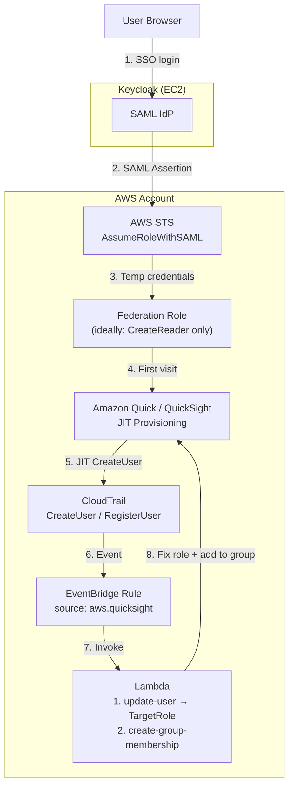
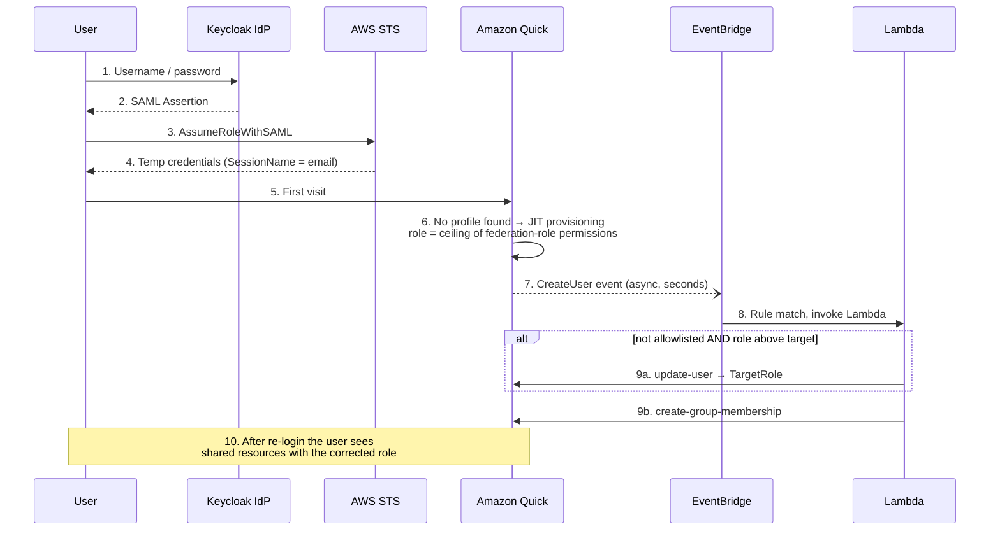

# Managing Amazon Quick (QuickSight) User Roles under Keycloak Federation

> [中文版本](quicksight-user-role-management.zh.md)

This document answers three questions for deployments of this stack:

1. **What role do JIT-provisioned users get with the default policy?**
2. **How to change a user's role with the AWS CLI?**
3. **How to automatically fix roles and group membership on first login (EventBridge + Lambda)?**

---

## 1. Default Policy and JIT Provisioning

### 1.1 The default federation policy in this template

`keycloak-quick-desktop-cfn.yaml` creates a SAML federation role with this inline policy:

```yaml
Policies:
  - PolicyName: QuickSightAccess
    PolicyDocument:
      Version: '2012-10-17'
      Statement:
        - Effect: Allow
          Action: 'quicksight:*'    # wildcard
          Resource: '*'
```

### 1.2 How QuickSight decides the JIT role

When a Keycloak user who has **not** been pre-registered logs in through SSO for the first time, QuickSight performs **Just-In-Time (JIT) provisioning** and assigns a role based on the permissions of the federation role — taking the **highest** tier available:

| Federation role has permission | JIT-provisioned role |
|---|---|
| `quicksight:CreateAdmin` | **ADMIN** |
| `quicksight:CreateUser` | AUTHOR |
| `quicksight:CreateReader` | READER |

> **⚠️ With the default `quicksight:*` policy, every JIT-provisioned user becomes an ADMIN.**
> This is both a security concern (new users can administer the whole Quick account) and a cost concern (Author-tier billing vs ~$3/month for READER).

### 1.3 Fix: narrow the federation policy (first line of defense)

Federated sign-in itself only needs `CreateReader`. Narrow the policy so JIT can never create anything above READER:

```bash
# Back up the current policy first
aws iam get-role-policy \
  --role-name <YourFederationRoleName> \
  --policy-name QuickSightAccess > backup-policy.json

# Narrow to reader-only JIT
aws iam put-role-policy \
  --role-name <YourFederationRoleName> \
  --policy-name QuickSightAccess \
  --policy-document '{"Version":"2012-10-17","Statement":[{"Effect":"Allow","Action":["quicksight:CreateReader"],"Resource":"*"}]}'
```

Notes:

- Only affects **future first-time logins**; existing users keep their current roles.
- Admin operations (register-user, etc.) should run under a separate operator profile, not the federation role.

---

## 2. Changing a User's Role with the AWS CLI

Federated QuickSight usernames follow the format `{RoleName}/{SessionName}`, e.g.
`QuickSight-Keycloak-SSO-Role/user@example.com`.

```bash
# Inspect the current role
aws quicksight describe-user \
  --aws-account-id <ACCOUNT_ID> --namespace default \
  --user-name "<RoleName>/user@example.com" \
  --query 'User.Role'

# Change the role (e.g. ADMIN -> READER_PRO). --email is required.
aws quicksight update-user \
  --aws-account-id <ACCOUNT_ID> --namespace default \
  --user-name "<RoleName>/user@example.com" \
  --email "user@example.com" \
  --role READER_PRO
```

Valid roles: `READER` | `READER_PRO` | `AUTHOR` | `AUTHOR_PRO` | `ADMIN` | `ADMIN_PRO`.

**Pre-registration** (skip JIT entirely and pick the role up front):

```bash
aws quicksight register-user \
  --aws-account-id <ACCOUNT_ID> --namespace default \
  --identity-type IAM \
  --iam-arn "arn:aws:iam::<ACCOUNT_ID>:role/<YourFederationRoleName>" \
  --session-name "user@example.com" \
  --email "user@example.com" \
  --user-role READER_PRO
```

Pre-registered users see shared resources immediately on first login. JIT users need to log out and back in after being added to a group (see below).

---

## 3. Automation: EventBridge + Lambda on First Login

The optional extension [`extensions/quick-auto-group-cfn.yaml`](../extensions/quick-auto-group-cfn.yaml) deploys an event-driven governor. When QuickSight emits a `CreateUser` (JIT) or `RegisterUser` (API) event, a Lambda:

1. **Downgrades** the new user to a target role (default `READER_PRO`) unless the email is on an allowlist, and
2. **Adds** the user to a shared group (default `workshop-users`) so they can access shared Spaces/Connectors.

```bash
aws cloudformation deploy \
  --template-file extensions/quick-auto-group-cfn.yaml \
  --stack-name quick-auto-group \
  --capabilities CAPABILITY_NAMED_IAM \
  --parameter-overrides \
      QuickGroupName=workshop-users \
      TargetRole=READER_PRO \
      AdminAllowlist="admin1@example.com,admin2@example.com"
```

### 3.1 Architecture



### 3.2 Sequence (first login)



### 3.3 Known behaviors

- **JIT `CreateUser` is an AWS Service Event**, not an API Call. The event carries the username as `RoleName:email` (colon separator); the QuickSight API expects `RoleName/email`. The Lambda converts it.
- There is a **window of seconds-to-minutes** between JIT provisioning (step 6) and the Lambda fix (step 9). Narrowing the federation policy (Section 1.3) eliminates the risk during that window; the Lambda then acts as a safety net and group manager.
- Users added to a group **after** their session was established must log out and back in to see shared resources. Pre-registered users are unaffected.
- `update-user` fails without `--email`.

---

## 4. Defense-in-depth summary

| Layer | Mechanism | Nature |
|---|---|---|
| 1 | Narrow federation policy to `CreateReader` | Preventive — caps the JIT role ceiling |
| 2 | Pre-register planned users with `register-user --user-role ...` | Planned path — smooth first-login UX |
| 3 | EventBridge + Lambda downgrade + auto-group | Detective/corrective — catches unplanned users |
