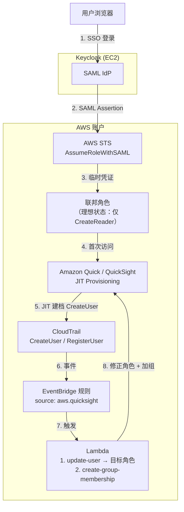
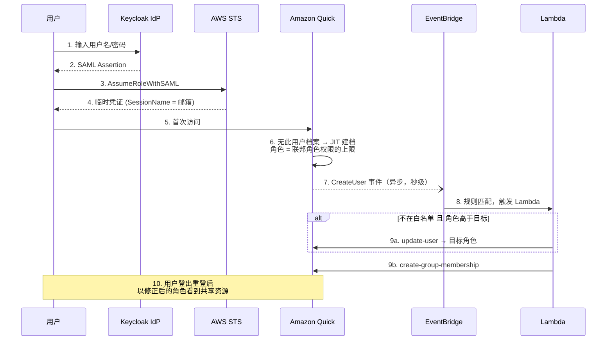

# Keycloak 联邦登录下的 Amazon Quick (QuickSight) 用户角色管理

> [English version](quicksight-user-role-management.md)

本文档面向本方案的部署者，回答三个问题：

1. **默认 policy 下，JIT 自动创建的用户是什么角色？**
2. **如何用 AWS CLI 修改用户角色？**
3. **如何用 EventBridge + Lambda 在用户首次登录时自动修正角色并加入组？**

---

## 1. 默认 Policy 与 JIT Provisioning

### 1.1 本模板的默认联邦 Policy

`keycloak-quick-desktop-cfn.yaml` 创建的 SAML 联邦角色挂载了如下内联策略：

```yaml
Policies:
  - PolicyName: QuickSightAccess
    PolicyDocument:
      Version: '2012-10-17'
      Statement:
        - Effect: Allow
          Action: 'quicksight:*'    # 全通配
          Resource: '*'
```

### 1.2 QuickSight 如何决定 JIT 角色

**未预注册**的 Keycloak 用户首次通过 SSO 登录时，QuickSight 会执行 **JIT (Just-In-Time) provisioning** 自动建档，角色由联邦角色所拥有的 IAM 权限决定——取**最高档**：

| 联邦角色拥有的权限 | JIT 建档角色 |
|---|---|
| `quicksight:CreateAdmin` | **ADMIN** |
| `quicksight:CreateUser` | AUTHOR |
| `quicksight:CreateReader` | READER |

> **⚠️ 在默认的 `quicksight:*` 策略下，每一个 JIT 创建的用户都会成为 ADMIN。**
> 这既是安全问题（新用户可以管理整个 Quick 账户），也是成本问题（按 Author 档计费，而 READER 仅约 $3/月）。

### 1.3 修复：收窄联邦 Policy（第一道防线）

联邦登录本身只需要 `CreateReader` 权限。收窄后，JIT 最高只能建出 READER：

```bash
# 先备份现有 policy
aws iam get-role-policy \
  --role-name <你的联邦角色名> \
  --policy-name QuickSightAccess > backup-policy.json

# 收窄为仅允许 JIT 建 READER
aws iam put-role-policy \
  --role-name <你的联邦角色名> \
  --policy-name QuickSightAccess \
  --policy-document '{"Version":"2012-10-17","Statement":[{"Effect":"Allow","Action":["quicksight:CreateReader"],"Resource":"*"}]}'
```

注意：

- 只影响**未来新用户的首次登录**，已存在用户的角色不变。
- 管理操作（register-user 等）应使用独立的运维 profile 执行，不要经过联邦角色。

---

## 2. 用 AWS CLI 修改用户角色

联邦用户在 QuickSight 中的用户名格式为 `{角色名}/{SessionName}`，例如
`QuickSight-Keycloak-SSO-Role/user@example.com`。

```bash
# 查看当前角色
aws quicksight describe-user \
  --aws-account-id <账户ID> --namespace default \
  --user-name "<角色名>/user@example.com" \
  --query 'User.Role'

# 修改角色（如 ADMIN -> READER_PRO）。--email 为必填。
aws quicksight update-user \
  --aws-account-id <账户ID> --namespace default \
  --user-name "<角色名>/user@example.com" \
  --email "user@example.com" \
  --role READER_PRO
```

可选角色：`READER` | `READER_PRO` | `AUTHOR` | `AUTHOR_PRO` | `ADMIN` | `ADMIN_PRO`。

**预注册**（完全绕过 JIT，提前指定角色）：

```bash
aws quicksight register-user \
  --aws-account-id <账户ID> --namespace default \
  --identity-type IAM \
  --iam-arn "arn:aws:iam::<账户ID>:role/<你的联邦角色名>" \
  --session-name "user@example.com" \
  --email "user@example.com" \
  --user-role READER_PRO
```

预注册用户首次登录即可看到共享资源；JIT 用户在被加组后需要登出重登才能看到（见下文）。

---

## 3. 自动化：EventBridge + Lambda 首次登录治理

可选扩展 [`extensions/quick-auto-group-cfn.yaml`](../extensions/quick-auto-group-cfn.yaml) 部署了一套事件驱动的治理器。当 QuickSight 发出 `CreateUser`（JIT）或 `RegisterUser`（API）事件时，Lambda 会：

1. 将新用户**降级**到目标角色（默认 `READER_PRO`，白名单邮箱除外）；
2. 将用户**加入共享组**（默认 `workshop-users`），使其能访问共享的 Spaces / Connectors。

```bash
aws cloudformation deploy \
  --template-file extensions/quick-auto-group-cfn.yaml \
  --stack-name quick-auto-group \
  --capabilities CAPABILITY_NAMED_IAM \
  --parameter-overrides \
      QuickGroupName=workshop-users \
      TargetRole=READER_PRO \
      AdminAllowlist="admin1@example.com,admin2@example.com"
```

### 3.1 架构图



### 3.2 时序图（用户首次登录）



### 3.3 已知行为

- **JIT `CreateUser` 是 AWS Service Event**，不是 API Call。事件中的用户名格式为 `角色名:邮箱`（冒号分隔），而 QuickSight API 要求 `角色名/邮箱`，Lambda 已做转换。
- JIT 建档（第 6 步）到 Lambda 修正（第 9 步）之间存在**秒级到分钟级的时间窗口**。收窄联邦 policy（1.3 节）可以从源头消除该窗口内的风险，Lambda 则作为兜底和加组器。
- 在会话建立**之后**被加组的用户，需要登出重登才能看到共享资源；预注册用户不受影响。
- `update-user` 不带 `--email` 会报错。

---

## 4. 三层纵深防御总结

| 层 | 手段 | 性质 |
|---|---|---|
| 1 | 收窄联邦 policy 至 `CreateReader` | 事前防御——钉死 JIT 角色上限 |
| 2 | 计划内用户 `register-user --user-role ...` 预注册 | 计划路径——首登体验丝滑 |
| 3 | EventBridge + Lambda 自动降级 + 加组 | 事后兜底——覆盖计划外用户 |
